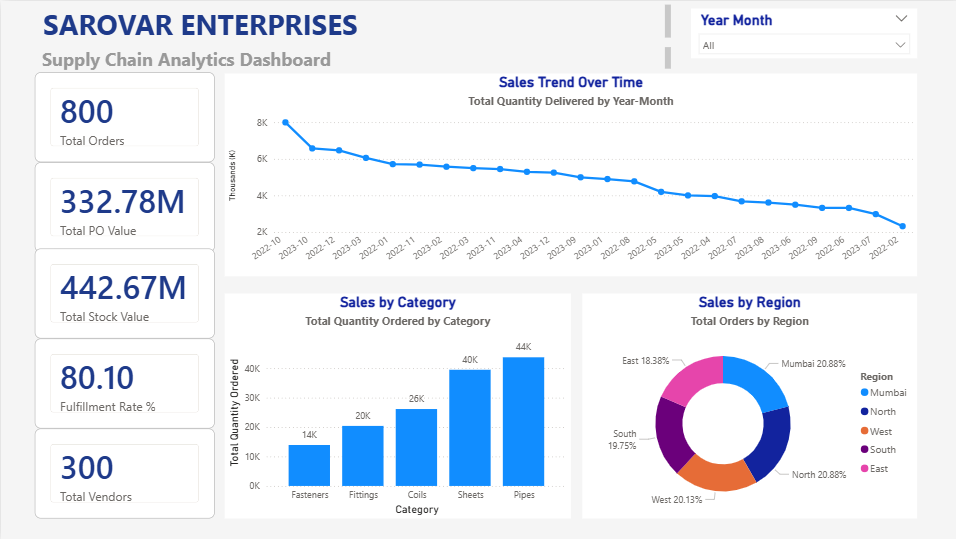

# 📊 Sarovar Supply Chain Analytics Platform

End-to-end supply chain analytics solution with **dual dashboards**:

## 🚀 Live Demo

### 1. Streamlit Web App
🔗 [Live App](https://sarovar-supply-chain-analytics-d2qwzq6ljfrkhlumqzvckc.streamlit.app/)

### 2. Power BI Dashboard
📁 [View Power BI](./powerbi/)

## 🎯 Project Overview
Built for **Sarovar Enterprises**, a Mumbai-based manufacturing company, this platform provides:
- Real-time inventory tracking
- Vendor performance scoring
- ML-powered demand forecasting
- Automated alerts and insights

## 🛠️ Tech Stack

### Streamlit App
- Python 3.11
- Streamlit
- Pandas, NumPy
- Plotly, Matplotlib
- Statsmodels (Forecasting)

### Power BI
- Power BI Desktop
- DAX (27+ measures)
- Star Schema modeling

### Data
- 8 CSV datasets
- SQLite database
- Time series: Jan 2022 - Dec 2023

## 📂 Project Structure

\`\`\`
sarovar-supply-chain-analytics/
├── data/                   # CSV datasets
├── streamlit_app/         # Streamlit application
│   ├── app.py
│   ├── pages/
│   └── utils/
├── powerbi/              # Power BI dashboards
│   ├── *.pbix
│   └── screenshots/
├── notebooks/            # Jupyter analysis
├── scripts/              # Data processing
├── sql/                  # SQL queries
└── requirements.txt
\`\`\`

## 🚀 Getting Started

### Streamlit App
\`\`\`bash
pip install -r requirements.txt
streamlit run streamlit_app/app.py
\`\`\`

### Power BI Dashboard
1. Download Power BI Desktop (free)
2. Open `powerbi/Sarovar_Supply_Chain_Dashboard.pbix`
3. Data auto-refreshes from `/data` folder

## 📊 Features

- ✅ Executive KPI Dashboard
- ✅ Inventory Management
- ✅ Vendor Scorecards
- ✅ Demand Forecasting (ARIMA/Prophet)
- ✅ Critical Stock Alerts
- ✅ Multi-page interactive reports

## 📝 Author
**Nainil Shah**
- LinkedIn: https://www.linkedin.com/in/nainil-shah-a440b728b/
- GitHub: [@nainilshah04](https://github.com/nainilshah04)

## 📄 License
MIT License