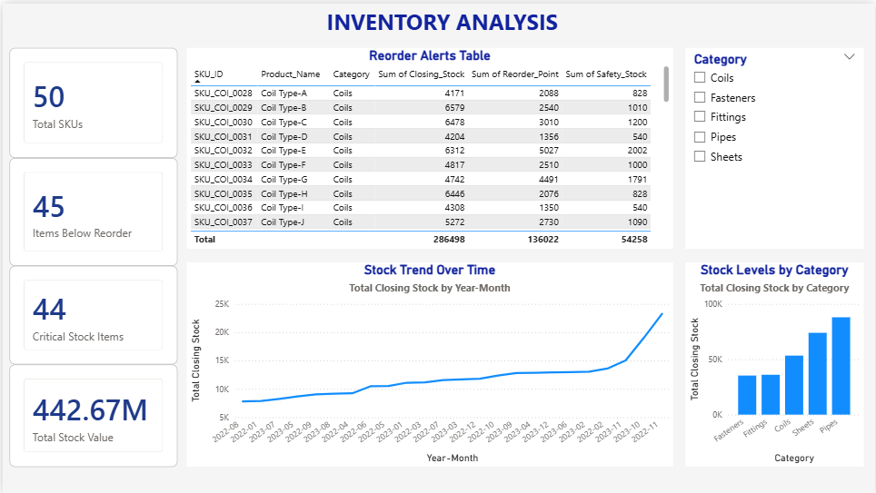
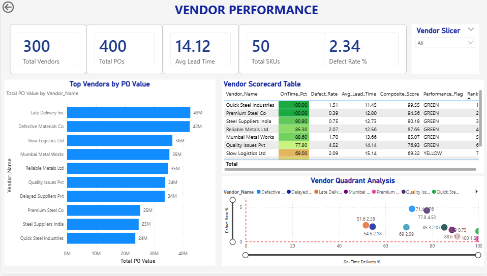
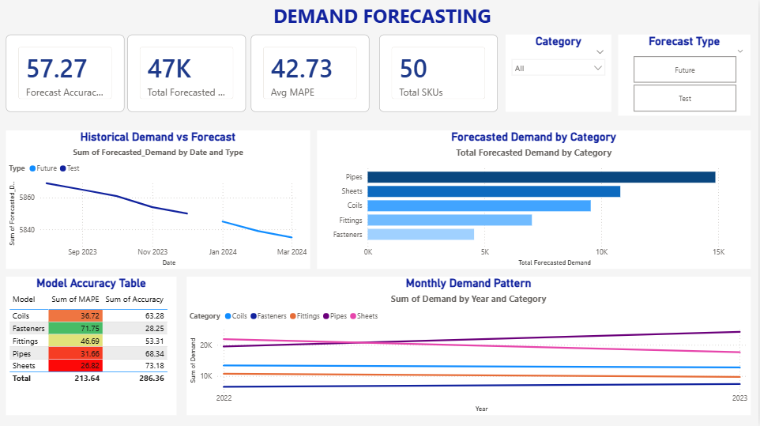
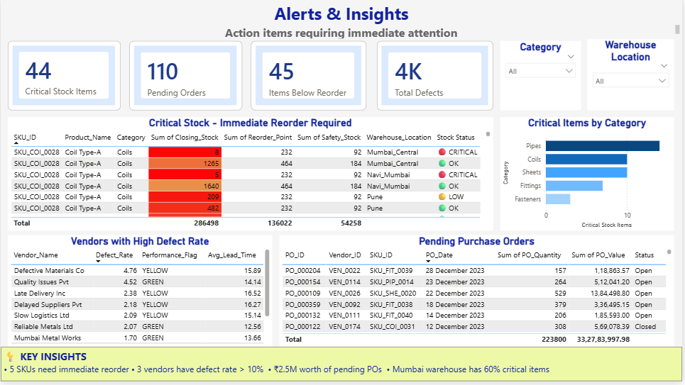

# 📊 Sarovar Supply Chain - Power BI Dashboard

## 🎯 Overview
Interactive Power BI dashboard for end-to-end supply chain analytics, complementing the Streamlit web application.

## 📈 Dashboard Pages

### 1. Executive Summary

- Total Orders, PO Value, Stock Value KPIs
- Sales trend over time
- Category-wise and region-wise distribution

### 2. Inventory Analysis

- Stock levels by category
- Reorder alerts table
- Critical stock identification

### 3. Vendor Performance

- Top vendors by PO value
- Vendor scorecard with conditional formatting
- Quadrant analysis (On-Time vs Defect)

### 4. Demand Forecasting

- Historical vs Forecast comparison
- Category-wise predictions
- Model accuracy (MAPE) tracking

### 5. Alerts & Insights

- Critical stock alerts
- Defective vendor tracking
- Pending orders dashboard

## 🛠️ Tech Stack
- **Tool:** Microsoft Power BI Desktop
- **Data Modeling:** Star Schema with Date dimension
- **DAX Measures:** 27+ custom measures
- **Visualizations:** Cards, Bars, Lines, Donuts, Tables, Scatter

## 📂 Data Sources
- `inventory_data.csv` - Stock levels and reorder points
- `sales_orders.csv` - Sales transactions
- `purchase_orders.csv` - Procurement data
- `vendor_data.csv` - Vendor master data
- `vendor_scorecard.csv` - Vendor performance metrics
- `forecast_results.csv` - Demand forecasts
- `mape_scores.csv` - Forecast accuracy

## 🚀 How to Use
1. Download `Sarovar_Supply_Chain_Dashboard.pbix`
2. Open in Power BI Desktop (free download)
3. Data refresh automatically connects to CSV files in `/data` folder

## 📊 Key DAX Measures
- Total Orders, Fulfillment Rate %
- Total Stock Value, Items Below Reorder
- Defect Rate %, On-Time Delivery %
- Forecast Accuracy %, Total Forecasted Demand

## 📸 Screenshots
All page screenshots are in `/screenshots` folder.